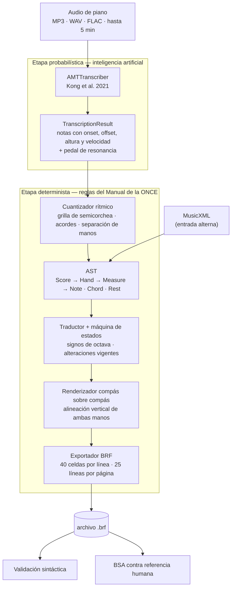

# amt-braille-translator

Convierte grabaciones de piano polifónico en partituras de musicografía Braille listas para leer en una línea Braille o imprimir en un embosser.

El problema que resuelve está en el hueco entre dos tecnologías maduras que nunca se hablaron: los modelos de Transcripción Musical Automática terminan su trabajo entregando un MIDI, y los traductores a Braille empiezan el suyo exigiendo una partitura digital ya estructurada. Entre ese punto final y ese punto de partida hay un tramo que hasta ahora recaía sobre el propio músico invidente, obligado a encadenar herramientas que no fueron diseñadas para comunicarse. Este proyecto cubre ese tramo completo, de audio a archivo BRF, sin intervención manual.

Trabajo de graduación · Universidad del Valle de Guatemala · Gustavo Cruz Bardales

## El pipeline



La separación en dos etapas es la decisión de diseño central del proyecto, no un detalle de implementación. La transcripción acústica es un problema probabilístico donde un error del 3 % se considera un resultado excelente; la musicografía Braille es un terreno determinista donde un solo punto omitido en un signo de octava altera el significado de toda una frase. Un modelo generativo entrenado para producir Braille directamente tendería a inventar notaciones inválidas con apariencia correcta, y la normativa no admite ese comportamiento. Por eso la IA se queda en la etapa acústica y la traducción se resuelve con reglas auditables contra un texto normativo.

## Qué hace y qué no

Procesa piano polifónico a dos manos y produce un archivo BRF conforme al subconjunto de veintiocho reglas, en nueve secciones, del *Manual Simplificado de Musicografía Braille* (Aller Pérez, ONCE, 2001): notas y silencios, signos de octava, alteraciones y su vigencia dentro del compás, intervalos armónicos, in-accords, ligaduras de expresión y de prolongación, barras de compás, formato compás sobre compás y signos de mano.

Queda fuera del alcance: audio con voz cantada u otros instrumentos, notación visual en pentagrama, edición interactiva del Braille, procesamiento en tiempo real y las reglas avanzadas del Manual (ornamentos, matices detallados, signos de pedal en su notación Braille propia). El detalle completo, con su justificación técnica, está en [`docs/braille_rules_subset.md`](docs/braille_rules_subset.md).

## Instalación

```bash
git clone <repo> && cd amt-braille-translator
python -m venv .venv && source .venv/bin/activate
pip install -r requirements.txt
```

El checkpoint del modelo acústico se descarga solo la primera vez que se transcribe audio. Para trabajar únicamente con MusicXML no hace falta ni PyTorch ni GPU.

## Uso

**De MusicXML a BRF**, que es la vía más rápida para probar el traductor:

```bash
python run_demo.py examples/simple_piece.musicxml salida.brf
```

**De audio a BRF**:

```python
from pipeline import audio_to_brf
audio_to_brf("nocturno.wav", "nocturno.brf", tempo_bpm=60, beats=4, beat_type=4)
```

**Como API REST**:

```bash
uvicorn api.app:app --app-dir src
```

| Método | Ruta | Qué hace |
| --- | --- | --- |
| `POST` | `/transcriptions` | recibe el audio y encola el trabajo, devuelve su id |
| `GET` | `/transcriptions/{id}` | estado, latencia normalizada y validez del BRF |
| `GET` | `/transcriptions/{id}/brf` | descarga el archivo resultante |
| `GET` | `/health` | disponibilidad del servicio y del modelo |

**Medir la calidad del resultado** contra una transcripción de referencia:

```bash
PYTHONPATH=src python -m evaluation referencia.brf generado.brf
```

Devuelve la Exactitud de Símbolo Braille global y ponderada, con el desglose de aciertos, sustituciones, omisiones e inserciones por categoría sintáctica.

## Arquitectura

| Módulo | Responsabilidad |
| --- | --- |
| `src/amt/transcriber.py` | envoltura del modelo acústico; aísla PyTorch del resto |
| `src/amt/events.py` | contrato de datos entre las dos etapas |
| `src/amt/quantizer.py` | tiempos continuos a figuras rítmicas, acordes y manos |
| `src/braille_translator/model.py` | árbol de sintaxis abstracta de la partitura |
| `src/braille_translator/fsm.py` | contexto de octavas y alteraciones |
| `src/braille_translator/translator.py` | recorrido del árbol y emisión de celdas |
| `src/braille_translator/renderer.py` | formato compás sobre compás |
| `src/braille_translator/brf_exporter.py` | exportación y validación del BRF |
| `src/braille_translator/braille_tables.py` | tablas de símbolos cotejadas con el Manual |
| `src/api/` | API REST asíncrona |
| `src/evaluation/bsa.py` | métrica de exactitud sobre el Braille final |

El árbol de sintaxis abstracta no es un adorno: el formato compás sobre compás exige que las barras de ambas manos queden alineadas verticalmente, y como todas las celdas Braille ocupan el mismo ancho, el sistema no puede decidir el relleno sin conocer de antemano la longitud proyectada de los dos compases. Solo una representación jerárquica en memoria permite ese cálculo anticipado.

## Pruebas

```bash
python -m unittest discover -s tests
```

120 pruebas. Las de la API se omiten solas si FastAPI no está instalado. La correspondencia entre cada regla del Manual y la prueba que la verifica está en la sección de trazabilidad de [`docs/braille_rules_subset.md`](docs/braille_rules_subset.md).

## Documentación

- [`docs/braille_rules_subset.md`](docs/braille_rules_subset.md) — las veintiocho reglas implementadas, con su numeración original del Manual y su trazabilidad con el código y las pruebas.
- [`docs/bsa_metric.md`](docs/bsa_metric.md) — procedimiento de medición de la Exactitud de Símbolo Braille.
- [`docs/literature_review_amt.md`](docs/literature_review_amt.md) — revisión de modelos de transcripción y benchmark comparativo.
- [`notebooks/amt-benchmark-full.ipynb`](notebooks/amt-benchmark-full.ipynb) — benchmark reproducible sobre veinte obras completas de MAESTRO v3.0.0.

## Selección del modelo acústico

Sobre veinte obras completas de la partición de prueba de MAESTRO v3.0.0, medidas con `mir_eval`:

| Modelo | F1 onset | F1 nota (con offset) | NER | Latencia normalizada |
| --- | :---: | :---: | :---: | :---: |
| Kong et al. (2021) | 95.89 % | 83.74 % | 8.01 % | 0.097 |
| hFT-Transformer (2023) | 96.68 % | 89.30 % | 6.36 % | 0.079 |
| Basic Pitch (2022) | 64.75 % | 19.46 % | 63.37 % | 0.030 |

El sistema integra a **Kong et al. (2021)**. hFT-Transformer obtiene mejores métricas de nota, pero no detecta el pedal de resonancia, y su ventaja está en la precisión del offset, que el cuantizador rítmico absorbe al ajustar las duraciones a la grilla. Queda documentado como la extensión natural del sistema.

## Licencia

GPL-3.0. El proyecto se construye íntegramente sobre tecnología de código abierto para que pueda auditarse y extenderse sin costos de licenciamiento.

## Referencias

Aller Pérez, J. (2001). *Manual simplificado de musicografía braille: Versión para usuarios no ciegos*. ONCE.

Kong, Q., Li, B., Song, X., Wan, Y., & Wang, Y. (2021). High-resolution piano transcription with pedals by regressing onset and offset times. *IEEE/ACM TASLP, 29*, 3707–3717.

Krolick, B. (1998). *Nuevo manual internacional de musicografía braille* (F. J. Martínez Calvo, Trad.). ONCE.
