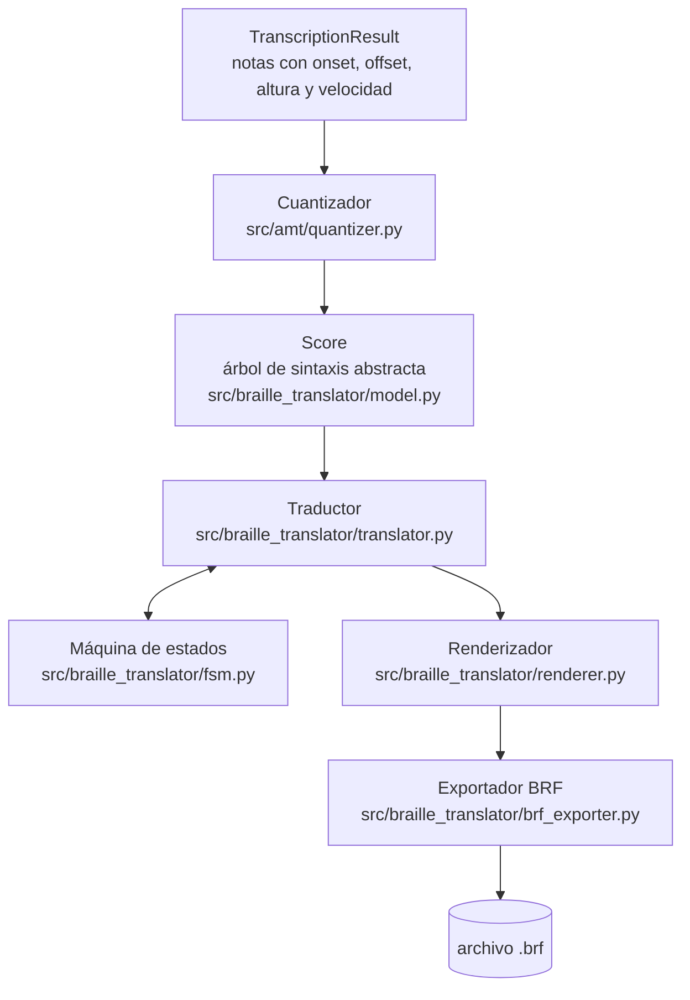

# Módulo determinista de traducción — Objetivo específico 3

Este documento describe la etapa determinista del sistema: el bloque que toma la salida del módulo de transcripción (o de un archivo MusicXML, en el banco de pruebas) y produce un archivo BRF válido, aplicando el subconjunto de veintiocho reglas descrito en `braille_rules_subset.md`.

La etapa tiene seis componentes que se ejecutan en orden fijo. Cada uno vive en su propio archivo y tiene una sola responsabilidad.

## Diagrama

La máquina de estados no es una etapa más en la fila: el traductor la consulta compás a compás mientras recorre el árbol, por eso el diagrama la dibuja como caja aparte y no en la línea principal.

## 1. Cuantizador

Archivo: `src/amt/quantizer.py`.

Recibe un `TranscriptionResult` (notas con tiempos en segundos) y produce un `Score`. Hace tres cosas: separa las notas entre mano derecha e izquierda según una altura de corte, redondea los tiempos continuos a una grilla de semicorchea (`TICKS_PER_QUARTER = 4`), y agrupa en acordes las notas que comparten el mismo instante de ataque. Una nota que no cabe entera en un compás se parte en varias unidas por ligadura de prolongación, sin perder duración total.

## 2. Árbol de sintaxis abstracta (AST)

Archivo: `src/braille_translator/model.py`.

Son las clases de datos que representan la partitura ya cuantizada: `Score`, `Hand`, `Measure`, y los tres tipos de evento (`Note`, `Chord`, `Rest`). Un `Chord` sabe distinguir su nota principal de las secundarias según la mano (`principal`, `secondary`), que es justo lo que el traductor necesita para decidir qué nota lleva el signo de la figura y cuáles se escriben como intervalo.

Este árbol existe porque el formato compás sobre compás (sección 5) necesita conocer de antemano cuánto mide cada compás de ambas manos para alinearlas verticalmente. Esa alineación no se puede resolver escribiendo celda por celda a medida que llegan los datos; hace falta tener la obra completa en memoria antes de emitir el primer carácter.

Es el componente que todavía me falta documentar a fondo y diagramar por separado; el diagrama de esta página cubre su lugar dentro del pipeline, pero no la relación entre sus propias clases.

## 3. Máquina de estados

Archivo: `src/braille_translator/fsm.py`.

Lleva dos contextos que el Braille musical necesita arrastrar entre notas:

- `OctaveState` decide si una nota necesita signo de octava, comparando su distancia con la nota anterior (unísono, segunda y tercera nunca llevan signo; sexta o mayor siempre lo lleva; cuarta y quinta dependen de si hubo cambio real de octava).
- `AccidentalState` lleva las alteraciones vigentes dentro del compás, inicializadas con la armadura de la clave y reiniciadas al empezar cada compás nuevo.

Cada mano tiene su propia instancia de ambos estados, porque la octava y las alteraciones de una mano no dependen de lo que esté pasando en la otra.

## 4. Traductor

Archivo: `src/braille_translator/translator.py`.

`HandTranslator` recorre los compases de una mano, consulta la máquina de estados para cada nota y arma la cadena de celdas Braille Unicode del compás. Dentro de un acorde, la nota principal se escribe como nota completa y las secundarias como intervalos respecto a ella; el caso del unísono (dos notas con la misma letra y octava pero distinta alteración) se resuelve como si fuera un intervalo de octava, que es el bug que corregí recientemente (ver el documento de avance técnico para el detalle).

Cuando el compás tiene cópula (varias voces simultáneas en la misma mano), cada voz se traduce por separado y se unen con el signo de cópula; las alteraciones no cruzan de una voz a otra.

## 5. Renderizador

Archivo: `src/braille_translator/renderer.py`.

Toma los compases ya traducidos de ambas manos y arma el formato compás sobre compás: agrupa los compases en líneas paralelas, alinea verticalmente el inicio de cada compás rellenando con una línea guía de punto 3 el que quede más corto, y antepone el signo de mano correspondiente a cada línea.

## 6. Exportador BRF

Archivo: `src/braille_translator/brf_exporter.py`.

Convierte el texto Braille Unicode a Braille ASCII (formato BRF), corta las líneas a cuarenta celdas sin partir un compás a la mitad, sangra las líneas de continuación, e inserta un salto de página cada veinticinco líneas. También expone `validate_brf`, que revisa un archivo ya escrito y reporta líneas demasiado largas o caracteres fuera del alfabeto Braille ASCII.

## Trazabilidad con las pruebas

| Componente | Archivo de prueba |
| --- | --- |
| Cuantizador | `tests/test_amt.py` (clase `TestQuantize`) |
| Traductor, máquina de estados, renderizador, exportador | `tests/test_translator.py` |

El AST no tiene un archivo de prueba propio: sus clases se ejercitan indirectamente a través de las pruebas del traductor, porque su única función es servir de dato de entrada al resto del pipeline.
